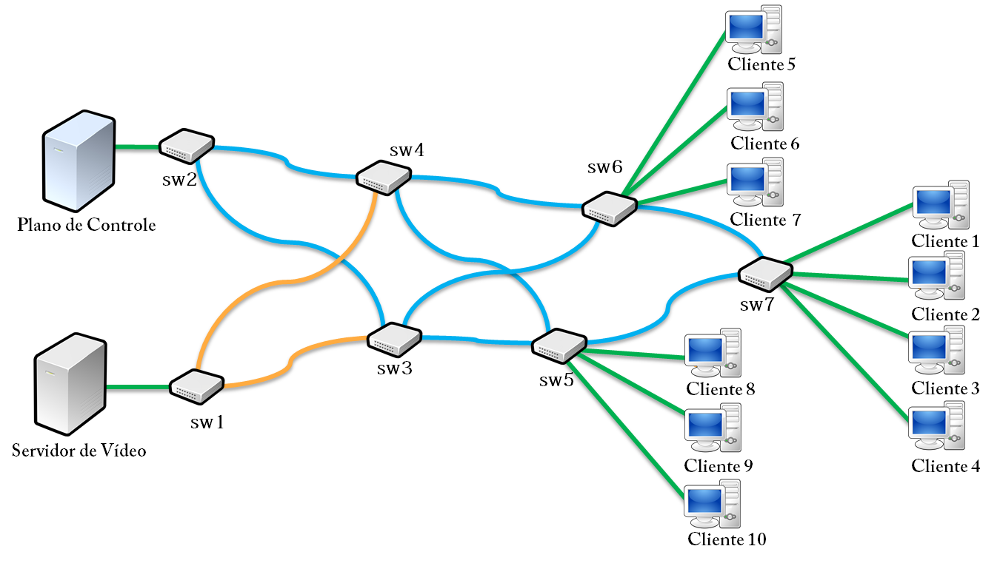

# CLASSICO-SDN
**C**ross **LA**yer **S**DN **S**ess**I**on **CO**ntrol is a communication architecture that aims at exploiting SDN substrate to offload the flow streaming computation task from the IoT cloud platform to SDN better forwarders, hence affording high timeliness and scalability for the IoT-cloudified system as whole.

## Módulo Floodlight

Estendendo o [Floodlight], as classes do módulo do [CLASSICO] estão no pacote `net.floodlightcontroller.classico`, e possui `CLASSICOModule.java` como Classe principal. O módulo é subdividido em dois outros pacotes:

*  `sessionmanager`: Controla as classes do modelo de sessão, mantendo a tabela de sessões atualizada
*  `pathscontrol`: Contém as classes de controle de Fluxo e Grupos, além de coletar as estatísticas da Rede de contínua.

## Mininet

O [Mininet] é uma aplicação responsável pela virtualização dos componentes de Rede, e utilizamos para compor uma simulação do Testbed, a fim de facilitar o desenvolvimento.

 * Bandwidth = 100Mbit/s;
 * Latency = 5ms;
 * IP Controller = 127.0.0.1
 * Port Controller = 6653

<kbd>
    

</kbd>

## Guia Inicial

Para instalar todas as dependências, execute:

    ./install.sh

Será instalado todos os programas necessários, entre eles: Java8, Evalvid, mininet etc.

## Aplicação

Para testar o módulo, foi criado um script:

* classico.py: Cria a topologia, inicia os iperfs, executa as aplicações clientes e servidor.

### Experimento CLASSICO X Multicast-SDN

1. Em seu workspace, clone este projeto, que corresponde a um módulo do floodlight:
      
         git clone https://github.com/Barbalho12/classico-sdn.git

2. Clone também o projeto original do floodlight no mesmo diretório (onde será executado o Multicast):

         git clone https://github.com/floodlight/floodlight.git

3. Entre no diretório do módulo CLASSICO:
    
         cd classico-sdn

4. Não feche outras aplicações (como navegadores) e de preferência desative a conexão com a internet, e então execute o script de avaliação passando como parâmetro o nome do arquivo de saída, onde conterá todos os resutlados da avaliação:
   
         ./run.sh avaliação_0

5. Espere até o fim da execução, ao final os dados estarão disponíveis no diretório `classico-sdn/evalvid/experiemntos/` e também compactado no mesmo diretório com o texto passado por parâmetro `avaliação_0.zip`.

   [Floodlight]: <https://github.com/floodlight/floodlight>
   [Mininet]: <http://mininet.org/>
   [CLASSICO]: <https://github.com/Barbalho12/classico-sdn/tree/master/floodlight/src/main/java/net/floodlightcontroller/classico>
   

