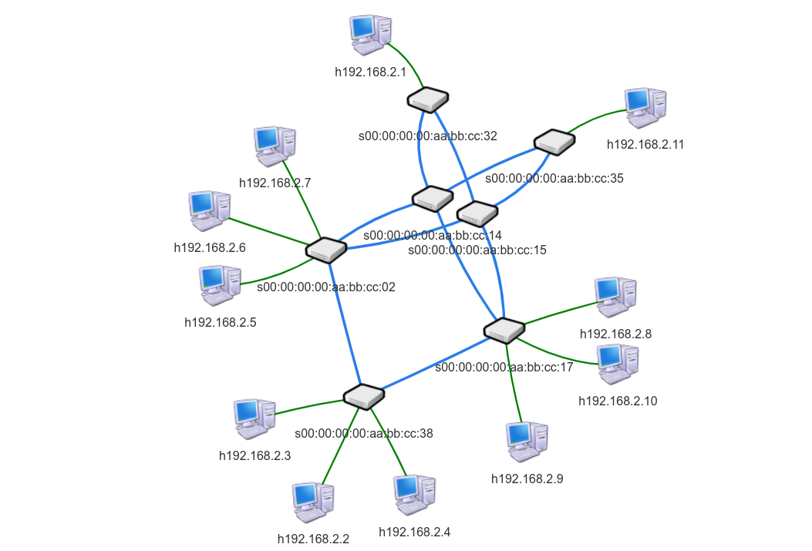

# CLASSICO-SDN
**C**ross **LA**yer **S**DN **S**ess**I**on **CO**ntrol is a communication architecture that aims at exploiting SDN substrate to offload the flow streaming computation task from the IoT cloud platform to SDN better forwarders, hence affording high timeliness and scalability for the IoT-cloudified system as whole.

## Módulo Floodlight

Estendendo o [Floodlight], as classes do módulo do [CLASSICO] estão no pacote `net.floodlightcontroller.classico`, e possui `CLASSICOModule.java` como Classe principal. O módulo é subdividido em dois outros pacotes:

*  `sessionmanager`: Controla as classes do modelo de sessão, mantendo a tabela de sessões atualizada
*  `pathscontrol`: Contém as classes de controle de Fluxo e Grupos, além de coletar as estatísticas da Rede de contínua.

## Mininet

O [Mininet] é uma aplicação responsável pela virtualização dos componentes de Rede, e utilizamos para compor uma simulação do Testbed, a fim de facilitar o desenvolvimento.

 * Bandwidth = 100Mbit/s;
 * Latency = 5ms;
 * IP Controller = 127.0.0.1
 * Port Controller = 6653

<kbd>
    

</kbd>

## Guia Inicial

Para instalar todas as dependências, execute:

    ./install.sh

Será instalado todos os programas necessários, entre eles: Java8, Evalvid, mininet etc.

Para iniciar o Mininet execute o script:

    sudo python mn/testbed.py

## Aplicação

Para testar o módulo, foi criado dois programas em 'scripts':

* server.py: Espera por requisição de um Cliente especificando um arquivo de vídeo como por exemplo "sample.mp4" no conteúdo da mensagem, após a requisição, o vídeo referido é enviado para o endereço solicitado.

* client.py: Solicita um arquivo de vídeo ao Servidor

### Exemplo

1. Inicie o módulo CLASSICO:
      
         ant && java -jar target/floodlight.jar

2. Inicie o Mininet:

         sudo python mn/testbed.py

3. No mininet, teste se os Hosts criados estão se comunicando:
    
         mininet> pingall

4. Abra dois terminais externos para h3 e h2 no mininet:
   
         mininet> xterm h3 h2

5. Execute o Server em h3:

         python server.py

6. Execute o Client em h2:

         python client.py 192.168.2.110 8888 sample.mp4

7. LOG **simplificado** da execução do exemplo:

         [MONITOR] There are no candidate paths to update
         [ExecutorPathFlowSDN] No changes in Flows
         (...)
         [MONITOR] There are no candidate paths to update
         [ExecutorPathFlowSDN] No changes in Flows
         (...)
         [MONITOR] There are no candidate paths to update
         [ExecutorPathFlowSDN] No changes in Flows
         (...)
         ------------ Table Sessions ----------

         [ID = 0, Description=sample.mp4, 
             List User=[UserSession [ID = 1, Address = 192.168.2.100:55099, Edge switch = aa:bb:cc:35]]]

         ------------ Candidate Paths Table ----------

         [Candidate Paths=10, Server=192.168.2.110:8888, User=192.168.2.100:55099, Session=sample2.mp4 ]

             Candidate Path: 32 -> 14 -> 35
                 Bw Consumption: 60bps
                 Latency: 17
                 Hop Count: 2
             Candidate Path: 32 -> 15 -> 35
                 Bandwidth Consumption: 60bps
                 Latency: 0
                 Hop Count: 2
             Candidate Path: 32 -> 14 -> 02 -> 15 -> 35
                 Bandwidth Consumption: 60bps
                 Latency: 5
                 Hop Count: 4

                 (...)

         ----------------------------------------------
         (...)
         [MONITOR] Update Candidate Paths
         [ExecutorPathFlowSDN] FLOW_MOD ADD: Switch: aa:bb:cc:32, Port:3, Reference: 192.168.2.110 -> 192.168.2.100
         [ExecutorPathFlowSDN] FLOW_MOD ADD: Switch: aa:bb:cc:14, Port:1, Reference: 192.168.2.110 -> 192.168.2.100
         [ExecutorPathFlowSDN] Update Flows
         (...)
         [MONITOR] Update Candidate Paths
         [ExecutorPathFlowSDN] No changes in Flows

#### Explicação 

[MONITOR] é uma thread que busca estatísticas da rede, e a cada unidade de tempo invoca [ExecutorPathFlowSDN], que como ainda não tem sessões na Tabela de sessões, exibe uma mensagem de que não há alterações. Em seguida, um cliente se registra em uma nova sessão e é impresso "Candidate Paths Table", com suas informações. Depois os caminhos candidatos entre o Switch de borda do servidor e do cliente são calculados e é exibido "Candidate Paths Table". Por fim [ExecutorPathFlowSDN] modifica a rede, adicionando fluxos em cada switch dos melhores caminhos.

   [Floodlight]: <https://github.com/floodlight/floodlight>
   [Mininet]: <http://mininet.org/>
   [CLASSICO]: <https://github.com/Barbalho12/classico-sdn/tree/master/floodlight/src/main/java/net/floodlightcontroller/classico>
   

